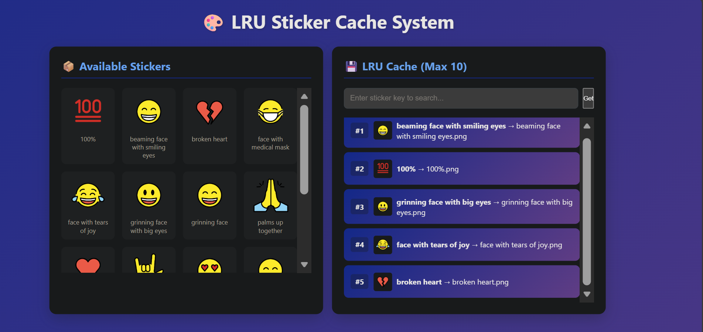

# LRU Sticker Project 🚀

A simple **sticker management web application** with **LRU cache** functionality.  
Users can view all available stickers, add them to a cache, and retrieve recently used stickers efficiently.

---



[](https://www.python.org/)  
[](https://flask.palletsprojects.com/)   

---

## 🏗 Project Structure

LRU-STICKER-PROJECT/
│
├─ backend/
│ ├─ emoji/ # Sticker images folder
│ ├─ lru/
│ │ ├─ init.py
│ │ └─ lru_cache.py # LRU Cache implementation
│ └─ app.py # Flask backend server
│
├─ static/
│ ├─ script.js # Frontend JS
│ └─ styles.css # CSS
│
├─ templates/
│ └─ index.html # Main HTML page
├─ requirements.txt # Python dependencies
├─ Dockerfile # Docker setup
└─ README.md

yaml
Copy code

---

## ⚡ Features

- View all stickers available in the backend (`/all-stickers`)
- Add stickers to a **LRU cache** (`/add`)
- Get sticker from cache (`/get/<key>`)
- View all cache contents (`/get_cache`)
- Most recent sticker endpoint (`/recent`)
- Dynamic frontend with **clickable stickers**

---

## 💻 Technologies Used

- **Python 3**
- **Flask** for backend API
- **JavaScript** for frontend interactivity
- **HTML & CSS** for UI
- **LRU Cache** implemented in Python
- **Docker** (optional)

---

## 🔧 Installation

### Clone the repository
```bash
git clone https://github.com/gurmeet788/lru-sticker-project.git
cd lru-sticker-project
Create virtual environment & install dependencies
bash
Copy code
python -m venv .venv
source .venv/bin/activate   # Linux/macOS
.venv\Scripts\activate      # Windows
pip install -r requirements.txt
Run the Flask server
bash
Copy code
python backend/app.py
Server runs on http://127.0.0.1:5000/

🚀 Usage
Open your browser: http://127.0.0.1:5000/

Click on any sticker to add it to cache

Use the search box to retrieve a sticker by key

Cached stickers appear in the cache list, most recent first

🧩 LRU Cache Implementation
Doubly linked list + dictionary for O(1) get and put

Default capacity: 10 stickers

Adding a sticker:

Moves it to the front of cache

Evicts least recently used sticker if cache is full

🌐 API Endpoints
Endpoint	Method	Description
/all-stickers	GET	List all stickers
/get-sticker/<name>	GET	Get sticker image file
/add	POST	Add sticker to cache ({"key":"", "value":""})
/get/<key>	GET	Get sticker from cache
/get_cache	GET	List all cache items
/recent	GET	Most recent sticker in cache
/	GET	Frontend page

📦 Docker (Optional)
Build Docker image
bash
Copy code
docker build -t lru-sticker-app .
Run container
bash
Copy code
docker run -p 5000:5000 lru-sticker-app
👤 Author
Gurmeet Kumar
Pakistan
Email: kuummaarr712@gmail.com

